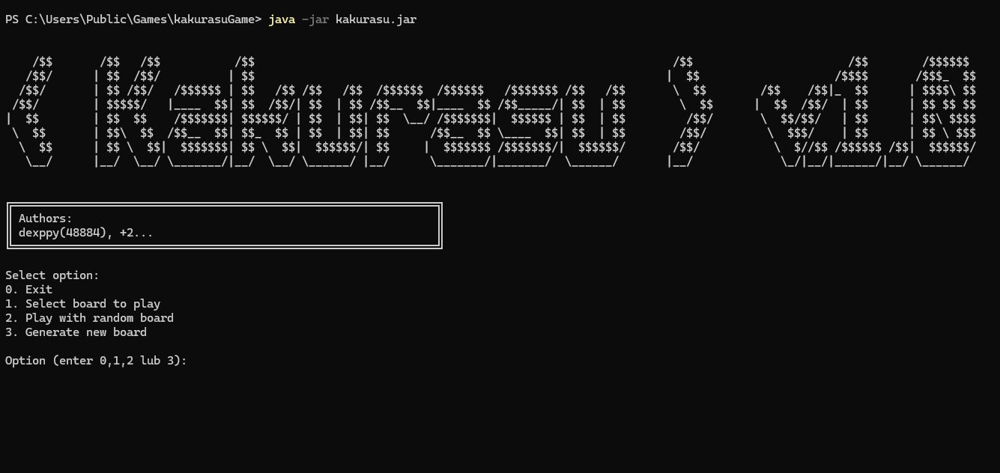
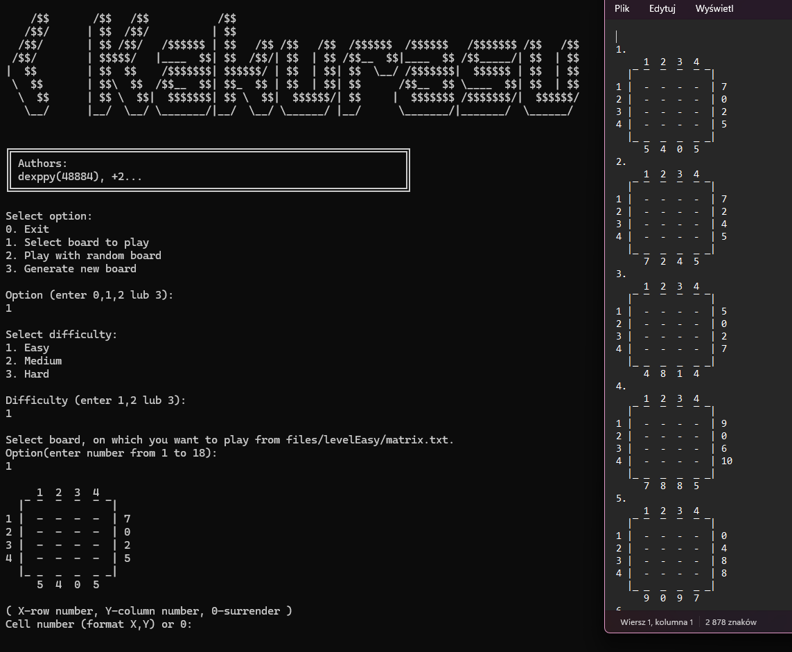
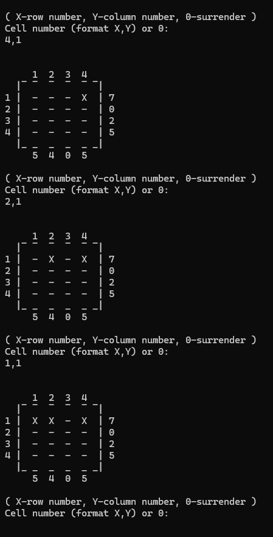
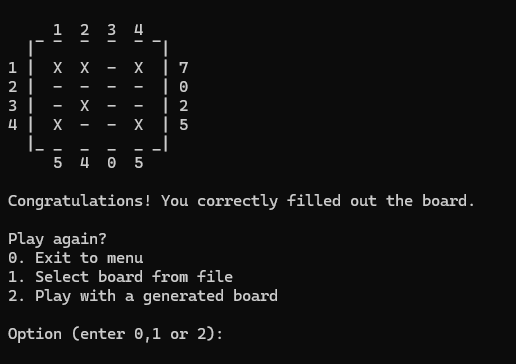
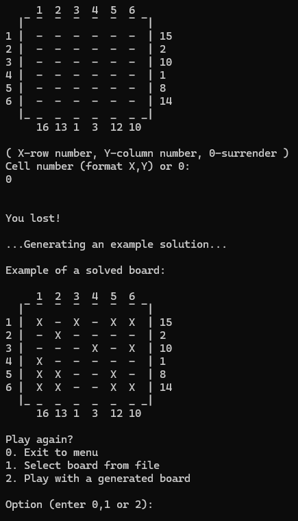
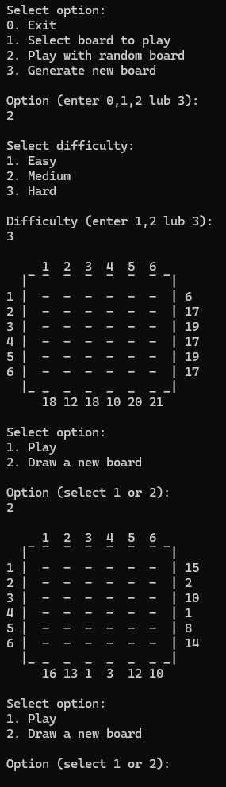
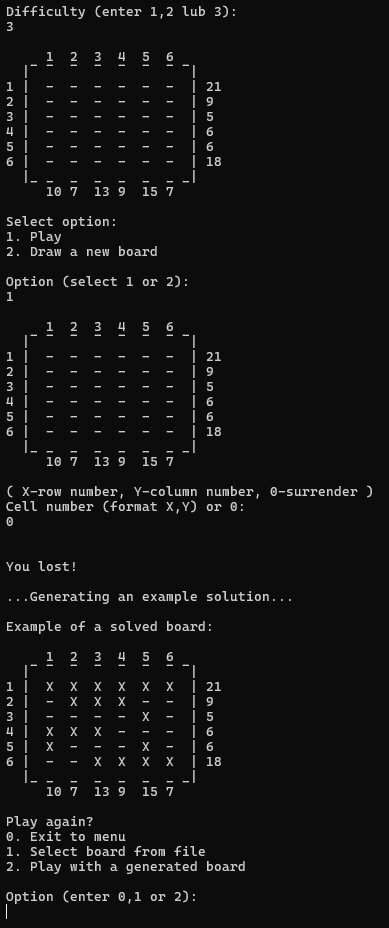

#  	🧩 Kakurasu Game in Java
A logic puzzle game Kakurasu developed as a university group project - pure Java, console interface. Aim of this project was to learn Java in practice.

## Description
Kakurasu is a number puzzle game, where player marks cells in a grid so that the sum of values in rows and columns matches the given edge clues. \
This game is designed for terminal use and runs as a console application, no GUI implemented (yet!).

## Features
* Support for easy, medium and hard difficulty, suitable for users of any experience.
* Ability to choose desired board, just find and select a perfect one in file games!
* Dynamic generation of new boards and appending them to game files.
* Easily mark and unmark cells by providing coordinates.
* Solution validation.
* Option to surrender and generate an example of a solution of played board.
* User friendly interface with clear console messages.


## Screenshots
### Menu


### Selecting desired board


### Gameplay

\

\


### Drawing new boards


### Dynamic board and solution generating
You can also generate new boards that aren't present in game files and ask for solution to it! \
\


## 🚀 How to run 
### 🔧 Requirements
* Java 20 or newer
* Operating system with terminal support (Windows, Linux, macOS)

### Download files
Go to the Realeses tab and download kakurasu.zip file, that contains:
* kakurasu.jar - the application
* files/ - folder with game files (boards, solutions..)
* README.md

### Running the Game
1. Extract the files into the same folder (e.g., kakurasu/)
2. **For Windows CMD use**: In order for boards to display properly, use UTF-8 encoding. Before running jar file, use this command:
``` bash
chcp 65001
```
3. Then run main file:
``` bash
java -jar kakurasu.jar
```

## Technologies
* Java 20
* IntelliJ IDEA
* Console/Terminal
* (Math skills 😎)

## Author
Project by: dexppy, +2 colleagues \
Year: 2023 \
Repository: github.com/dexppy/kakurasu
